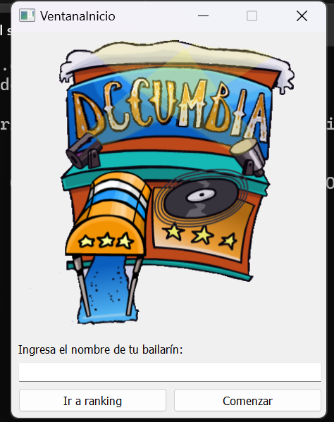
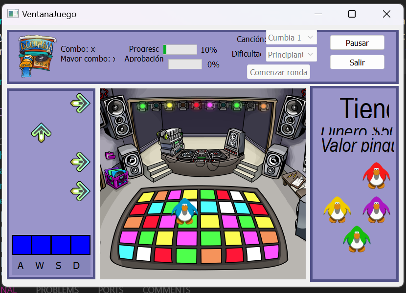

# Rythm Game

**Rythm Game** is a rhythm game developed using Python and PyQt5. The game simulates a dance floor where your character can dance to the rhythm of the music. The goal is to impress the audience with your amazing dance moves and advance through as many levels as possible to become a great Cumbia Master! This project was developed during the second semester of 2020 as part of my second-year Civil Engineering studies at Pontificia Universidad Católica de Chile.





## Table of Contents

- [Rythm Game](#rythm-game)
  - [Table of Contents](#table-of-contents)
  - [Program Flow](#program-flow)
  - [Key Mechanics](#key-mechanics)
    - [Dance Moves](#dance-moves)
    - [Arrow Types](#arrow-types)
    - [Combo](#combo)
    - [Difficulty](#difficulty)
    - [Scoring](#scoring)
    - [End of Level](#end-of-level)
    - [End of Game](#end-of-game)
  - [User Interface](#user-interface)
    - [Program Structure](#program-structure)
    - [Windows](#windows)
  - [How to Run](#how-to-run)

## Program Flow

In **Rythm Game**, the objective is to impress the audience by hitting the right dance moves in time with the music and surviving as many levels as possible. Before starting a level, the player must set up the game by selecting configurations such as a song and difficulty. During the level, a sequence of arrow keys will appear on the screen, which the player must hit to generate dance steps.

At the end of the round, the game will show the player's performance with an approval rating and a score. The approval rating determines whether the player can continue to the next level or if the game will end. Players can continue playing for as long as their approval rating is high enough, accumulating points to purchase additional dancers.

## Key Mechanics

### Dance Moves

During each level, arrows will descend on the screen, and the player must press the corresponding keys when the arrows reach the "capture zone" to perform dance moves. The game features two types of steps:

1. **Normal Steps**: A single arrow key press.
2. **Combined Steps**: Two or more arrow key presses at the same time.

The accuracy of the player's inputs determines the success of the dance move. A correctly timed move increases the player's score, while incorrect moves lower the approval rating.

### Arrow Types

There are various types of arrows, each with different properties:

- **Normal Arrows**: Move at a default speed and give a standard score.
- **x2 Arrows**: Provide double points when hit.
- **Golden Arrows**: Move 50% faster and give 10x points.
- **Ice Arrows**: Slow down the movement speed of all arrows temporarily.

Each arrow type has a distinct visual representation. For example:

- Normal arrows are green.
- x2 arrows are blue.
- Golden arrows are yellow.
- Ice arrows are white.

### Combo

The game rewards players with a combo system that increases with consecutive correct inputs. A combo starts at 0 at the beginning of each level and increases by 1 for each successful move. An incorrect move resets the combo. The highest combo achieved is considered when calculating the total score at the end of the level.

### Difficulty

**Rythm Game** offers three difficulty levels:

1. **Beginner**: Levels last 30 seconds, and steps are generated every second. Only 4 basic steps (up, down, left, right) are required, and the minimum approval rating is 30.
2. **Intermediate**: Levels last 45 seconds, steps are generated every 0.75 seconds, and combinations of up to 2 arrows can appear. The minimum approval rating is 50.
3. **Master Cumbia**: Levels last 60 seconds, steps are generated every 0.5 seconds, and combinations of up to 3 arrows can appear. The minimum approval rating is 70.

### Scoring

At the end of each level, a score is calculated based on the player's performance. The score is computed using the following formula:

`score = max_combo * sum_arrows * ARROW_POINTS sum_arrows = (normal_arrows + 2 * x2_arrows + 10 * golden_arrows + ice_arrows)`

Where:

- `normal_arrows`, `x2_arrows`, `golden_arrows`, and `ice_arrows` represent the number of arrows successfully hit of each type.
- `max_combo` is the highest combo achieved during the level.

### End of Level

When the level's time is up, no more arrows will appear, and the music will stop. The game will display a summary window with the results of the round, including score, combo, and approval rating.

### End of Game

If the player fails to meet the minimum approval rating for the selected difficulty level, the game ends, and the final score is saved to a `ranking.txt` file. The player can then return to the main menu to view the ranking or start a new game.

## User Interface

### Program Structure

The game is divided into multiple phases and utilizes **threading** and **signals** to handle the interactions between the backend and the graphical interface. Proper modularization is used to maintain a separation between the game logic and the user interface.

### Windows

**Rythm Game** has several key windows that the player interacts with:

- **Main Menu**: The player can enter their username, view the ranking, or start a new game. If the username is invalid, an error message will be shown.
- **Game Window**: This is where the game is played. The game window consists of four main areas:
  1. **Dance Floor**: Shows the character and their dance moves.
  2. **Rhythm Zone**: Displays the arrows descending and the capture zone.
  3. **Store**: Available during the preparation phase to buy additional dancers (using drag-and-drop).
  4. **Statistics Area**: Displays game statistics such as song progress, approval percentage, current combo, and the highest combo achieved.
  
The game progresses through three phases:

1. **Preparation Phase**: Players can select a song, difficulty, and buy dancers.
2. **Gameplay Phase**: The music plays, and arrows appear for the player to hit.
3. **Post-Game Phase**: A summary window shows the results of the last round.

## How to Run

1. Clone the repository or download the source code.
2. Set up a virtual environment:

   ```bash
   deactivate
   rm -rf your_venv
   python3 -m venv your_venv
   source your_venv/bin/activate
   ```

3. Install the required dependencies using:

   ```bash
   pip install PyQt5
    ```

4. Run the game using:

   ```bash
   python main.py
    ```
